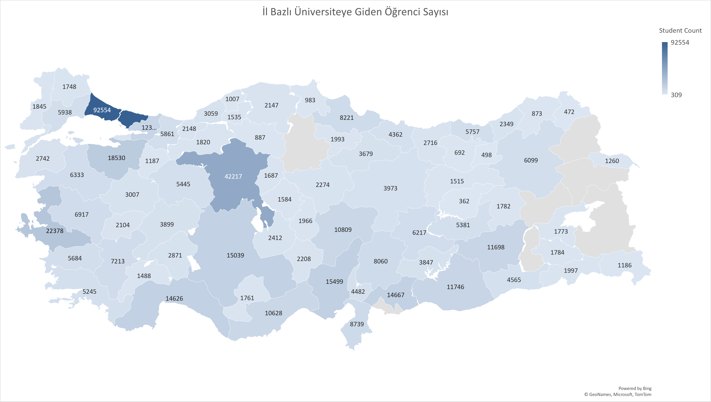

# Python University Data Scraper

## Intro

This Python script is designed for educational purposes and is intended to fetch and process data related to universities in Turkey based on specific codes provided by the Council of Higher Education (YÖK). Please note that commercial use is strictly prohibited, and the accuracy and currency of the data should be verified through official YÖK sources.

## Usage

The script will fetch and process the data, and the results will be printed. To simplify the process and work with the results more conveniently, you can use a separate Python script provided in this repository.

## Results and More

I copied the output of my program and visualized it with the help of Excel. You can see it under "results". By changing the department codes you can obtain other kinds of information, such as "students who went to the top 5 big cities in Türkiye", "Students who went to private universities", and "Students who went to the same university as they graduated from high school.". 

See the result: 

See the additional data: [Excel File](university_data_2023_all.xlsx)

Coded by: __Faruk Avcı__

